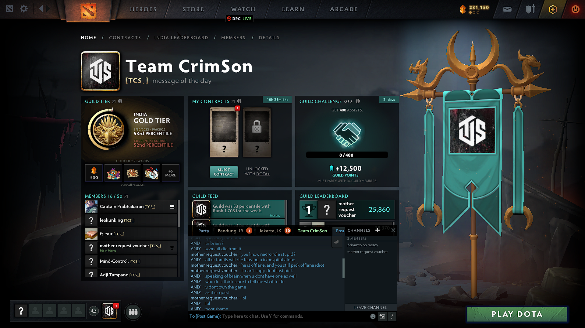

---

2023-01-03-i hate spotify

@spotify will not defeat @youtube music unless:
- it has translations in multi language and forms. for example, japanese songs, it needs multiple translation forms: japanese original words, Romanized version (title, artist, lyrics, etc). it applies as well to korean, chinese, thailand, javanese, etc. yt music is winning this because it has flexibility of user to upload so they can upload video lyrics, cover, etc.
- there's a social media like interaction in comment. have you seen a depressed comment in a depressed songs? thats the power of yt music. have you feel the positive vibe in almost indonesia koplo song's comment? thats the power of yt music

problems with spotify:
- @musixmatch is trash for lyrics, just please try collaborate with @genius instead of musixmatch.
- song recommendations, yt music will leap spotify in a matter of time.
- in related to translation, kobasolo is one of overrated popular cover bands in indonesia (some cover video viewers is more than the original songs). researcher could research whether official/community translation has part in making it viral. researcher could research from worldwide viewers whether they preference songs from @firstake or original music video or live performance.

apple music? oh my poor ear cant distinct Hi-res lossless audio with low quality so it's not relevant. 

---

2023-01-20

There's one in life that no one looks for.

No one praying for him.

No one comes to his grave when he die, even no one cares whether he is die or not.

One that is so 'low' that make everyone be grateful because there's someone who is worst than them. 

Someone that can't do things on his own, always need help from others. 

No one knows his value, other than non human things. 

He silent everyday in the corner of his room asking, will someone remember me, or my face. 

And he goes on the question day by day, till he numb himself, till he doesn't care anymore whether someone care about him or not.

He just goes on day by day

With an empty big cold smile 

---

2024-03-18

This is worst Ramadhan so far in my life. I lose my faith, I lie to much to myself and my coworkers because my stupidity brings me this meaningless job. 

I get used to not praying. Sometimes I ask myself what is the use of praying. Perhaps my heart has already died, I don't know whether there's a heart respawn or not. I get used to from previous months. Expetations are the worst. I really hate my teachers who said that god is like human, It really liked to be usefull, to be prayed, so ask for more is not a greedy behaviour, but rather a condition which you believe in something superior called god. 

Honestly I don't agree with him, because it contradicts the real life. Maybe it is just because of my disappointment to the omnitent, because I don't get what I want. Or maybe is just human things, we only interact with something as long as we get benefit from it, or they say the worst part is because the things that we are interacted with push away something that give us pain or punishment. 

They say the highest from of interaction is because we love something. We are as human always dicotomize everything. It's easier to think in a sequential way, than think in a more systematic ways of thinking. But always curious and assume that there might be a higher level of thinking, which is not sequential or systematic. Some people said that ony the omnipotent can do thinking with higher level than those. 

Some people say we don't need to try to think in the higher form of way of thinking. And they regard love as the higher form. But what they say is contextual based on what they experience rather than something objective. When you say love, some people regard that as sexual, something that reproduce and make humanity sustain longer. About sustainability, they are all physical and mental, or something spiritual.

You might see my writing is unstructured. But as you see from right now, AI is get easier to make something to be simpler, more efficient, summarize everything in more presice and to the point. And this is what makes me see that something efficient is not human, it is something artifial. 

When I see many people around on the internet become luddite, they even hate and cancel someone who use AI art. We get all these abundances from AI. But see about the responses from a broad of community, they are scared. And they are looking for anyone who as scared as they are. It kinda makes me sad. 

Talking about singularity, it's something that people afraid or embrace. Maybe it still takes a lot of time. But looking at luddite who hate who is using AI artist, it makes me see the depressed history about the industrial revolution. They really need their job so much in order to live. What makes me depressed is I can't relate them too much, because right now I'm living so easy in life, thanks to my dad. But at the same, time I really cursed him because he didn't use condom when he had having sex with my mother. You may say I really hate life my life because I wish hasn't been born before. But no, we can still love life while still wish otherwise. You can't accept contradiction because you still haven't think in a higher level way of thinking.

This is the worst Ramadhan so far. I still can't move on form the past. I know exactly that I am a misserable guy who wish too much from others or myself. But I still don't know which one to blame how my emotion can be easily manipulated, that I end up work in something I really hate or work with someone I don't admire because of fear of something ustable or uncertain. I still find someone to blame who is always making bad decision after all overthingking. Maybe I don't need something to blame, maybe I just need to accept and control it. What past is past, but I still need someone who is responsbile for all bad behaviour, because that is what skin in the game means. 

And one of the bad thing that still happened to me is how I can easily fall for someone I don't really know. This is a first unrequited love I get. I always convince myself, it is better to try than disappointment of never tring, but hell no. If we talk about the number, my success rate of confession is 3/4. It does not include some requited love I got, but unfortunately we end up not dating. If I include that number it will be a 9/10

---

2023-03-06

soshum is slow. 

instead of create some work of art/ experimenting something cool like new tech, contirbute to LLM, solve P-NP problems, and whatnot, fastering quantum computing use case, high performance computing, they are >>>

my smartest science friends end up doing QA, bullshit consultant jobs, fixing software bug, financial engineering

they afraid of something, termakan pengedar narkoba gaji stabil, tidak punya margin of safety, so they go low. menerima ajakan siapapun they don't admire that low paid, only high in comparison relatively to low income country.

soshum can't experiment basic UBI; stuck in democracy; maintaining status-quo that promote stupid incentive that drive rat race; can't invent new curreny, only speculate in digital currency; superficial entertainment things.

slow law and policy development. there lot of people with wasted potential afraid of lack of margin of safety, comfort in self-contentment. 

can't detect tax evasion, money laundering.

no mahasiswa force to revolution that is radical and comprehensive.

science progress to much, while soshum seem stagnant. indonesia still has no radical thinker that act beyond as-is condition. someone seem smart talks about anything that end up just being advisor of pinjol education. 

kindly need your help to clarify. 

---

2024-04-03

this is the arch of resigning from a company

---

2024-04-06

fail in colelge. 

most people highlight their achievement, but i prefer to share my failure :v.

i dont know why i want to reflect right now, maybe its because i am ~~unemployed~~.

- lack of gratitude
  - when my seniors at URBAN (paguyuban Bandung in UI) ask me how I feel when I accepted at UI, I answered, "b aja". maybe this is the start of the damnation
- not genuine and too jaim (jaga image)
  - i want to experiment something, the new me i guess.
  - i have an ambiton to become a leader of Muslim community.
    - why i got this ambition? i blame it to my prev classmate who is korwat (koordinator akhwat) in my high school that recommend me to become a chief of Rohis (Muslim Association) in my high school
    - this makes me feel like i can be repaired, i feel like i have a chance to be a good muslim
  - i try to pura-pura baik in front of others, like most of rohis, not talking and whatnot. 
  - when someone in faculty gathering said adult jokes, i pretend not to know and i hold my laugh, even though i sell flaskdisk full of bokep when i was in my SMP, and my phone became source of nobar bokep when in karya wisata to yogyakarta.
  - then i realized, im not terlalu akrab with friends there, only a few.
  - at first i adapt well in the faculty orientation period, the seniors are very friendly and i feel like i can keep up with them
  - then the second semester hit, i realized that i lonely and don't have many friends
  - i join muslim community too, but did not end up well. 
    - there was leadership training held by SALAM UI, but i only took part half heartedly, i dont know maybe its because i dont feel the chemistry
    - my team is IT force, and i was burdening the team because i cant code and design
    - i dont get well known with many members too. 
    - i dont do much contribution
  - when pandemic happens, i feel grateful while most people suffer, because i dont want to be looked by others
    - in pandemic mostly i explore anything other than CS. 
    - i procrastinate a lot by trying a lot of things, numbing myself by internet, youtube, movies, gaming, read philosophy psychology investment things like that.
  - i missed the chance to get to know most brilliant CS students in indonesia
- i only take courses that is easy
  - IS is easier than CS, i took courses that i feel like can get myself faster to end the college
  - i try faster to end my college because i dont fit well. 
- i dont really network with lecturers
  - its becuase i dont want menjilat lecturer.

maybe i would add later.

---

2024-04-08

i knew something wrong with me,

its just a simple choice, but i cant make a simple choice that really worth it. like when i imagine after i quit my job. its just a matter of choice, when
i meet with my family again, when i not met my father for a year because he works at another country. i can choose smile at them to my family, bring a positive
happy little vibe, but its hard. i can easily lie to anyone, but why is it so hard to lie to myself. some things i can lie about but not other things. 
i can lie about how i behave when in front off someone, but i feel that there's something off. i imagine myself talk honestly with smile to my family. 
but as i see mother still believe that i have the same believe as her, my intention to try to talk honestly is broken. 
its too hard for me to disappoint her, and i know i do that things not because i love her. its a lie, that i care about my family, everyhting is just a lie. 
everything is because of me. because im just too afraid, im too coward to tell honestly about what ive been through. bygone i want to be understood, 
but now it seems understanding is beyond human capabilities. what we can is only try. 

i imagine i met them, smile at them, talk to them that i happily quit my job, work with someone i dont admire. i want to talk to them that i want to explore myself, to have a gap year. to see what i really want in this life. because for now i still dont know what i want. i just know what i dont want. and i try everyday to validate my assumptions. perhaps life is just a set of cognitive biases. and i suppose biases are feature of human. sometimes we want to get rid of feature that we think should be erased, but realistically it is hard to remove, because it is part of the being that cant be separated. 

i dont know

I should clarify myself. Why can I be normal like most of the people. Why I always questioning everything. When I try to learn about all cognitive biases, I feel not only relieved but also regret. It's not enough to read only once. When I reread multiple times, I always laugh to myself, for how many I remember these are my biases. And when I remember all those biases, it doesn't make me pain again. I can laugh to my mistakes. Some said it is a progress. I believe it is just a part of acceptance of failure, to accept the loser within me. Had I read previously, I would not repeat the same mistakes again and again. But still for now, even after I read it, I always repeat that stupidity over and over again. 

I don't know why this happens. I always running from something I should do. Why I have this tendency to struggle something I know it won't worth it to pursue. Or I don't know maybe it is because I still make an effort towards it. Why history always repeat, because some human is curious by nature. Perhaps we are not curious by nature. Perhaps it is descended and taught by our ancestors to always curious, to question everything we saw and we feel. 

But the excess of that curiousity is burdening too. For I always skeptic about why should I do. What do I do wrong. What thing makes me feel satisfied in present and in the long term. And to keep questioning makes me can't start something. For when I start a little about something, whether it is practical or abstract things, I always giving up the consistency. And when I run too long, I always ask to myself, should I give up right now or is there uncertain high risk high return in pursuing it. When something got too hard I always ask, should I give more effort or is it just not for me. And all the question above is futile because in the end I just give up easily, because I don't want to be specialize. The feeling of don't want to be specialize makes me feel special. This is the very bias of me. 

Why I can't be like anyone. I take this information system degree in hope for practical life. But in the end I feel unsatisfied. Why can't I be like most of my friends. Taking deep interest towards frontend, backend, UI/UX, cyber security, ML/AI, system analyst, and whatnot. Consistent in what they are doing. Put their profression as their headline on their LinkedIn. Why can't I be like most of people. Feel great about personal branding using chatGPT to revise their resume. Why I feel like something is not right when I use that kinds of tool, like is it the indicator of something we should avoid. But at the same time, I also feel frightned of not survive if I don't follow the trend using those tools. Everyday I just don't feel right. I can't put confidently title in LinkedIn. Like they are very proud showing their headline, using their almamater as, "ex-company", profession. Some use cringe headline like Pokemon master/fulltime husband/investor and so on. I don't want to be labeled is my label.

Why can't I be like most of the people. They focus on 1 or 2 field until they master it comprehensivehly. While I always ask myself is it the right path for me or not. Then I start most projects I don't finished. To start a long term project is a things that against my will. Then I comeback again to philosophy, pessimism, cnynism, nihillism, and how I hate much about stoicism. Then I feel weary about abstract useless conceptual things. Then I start to learn data engineering, MLOPS, solution architect. But somehow I got bored because I think it is easy concepts if you're just put enough effort in it, especially because generative AI is realiable enough for if the case is not complex, and I see system development from scratch is really rare, most of it are just boring maintenance. Starting from scratch also usually just simple mundane projects. I got bored then I give up.

Then I see some contents like finance, investor things. What I wonder about them is the feeling of independence. That's why in my spare time I usually learn about these things. I start put my money to mutual funds since I have national indetity cards when I was in my senior high school period. And what I see the most in investors are they resemblance like philosophers, except most Indonesian influencer, they just like a scammer. Munger, Taleb, Naval, Soros, they have a character which I find amusing in life. I rarely see someone who do in real life like them. I try to learn quants, but then I watch youtube videos about how to find meaning in quant profession, and their justification is none. I see from a salaryman in Jujutsu and Soul movie that work as quant trader, their life is misserable even they make much money. Then I lose my interest to learn all of it. 

My life until now just revolves around those things. Tech things, Philosophy, Finance. Because I really don't know what I'm gonna do in my life. And I still haven't talk to you about my delusional ambition everyday that I want to become a marbot masjid. I want to have masjid to experiement most of my mad science engineering apporach. I need liberal mosque if exist, or any mosque that is open for my experiments. I don't know why I always think this much a lot. This is like something I've experienced before, to be questioned, should I just give up or should I try to put efforts in it. The thing is I don't know. So right now I just apply to any company that has opening jobs. I got experienced in data engineering, so I just apply to that. I don't know I really don't know what I want. I'm still searching for it. I hope that thing is searching for me too. I don't know if we ever find each other, I just can hope, I just need to put an effort. 

---

2024-04-16

---

2024-04-19

---

2024-04-25

i am doing nothing again. let me clarify, it's not true that i don't know what i want. i know what i want. i want to touch some boobs. i am not afraid of god, i'm just afraid of the irrational effect causes by the sound of thunder and the afterlife uncertain punishment. 

---

2024-04-28 - first earthquake

I felt the earthquake for the first time in my life, as previously I never experienced this, people just tell me to get out of room. It was 11:30 PM and I sat on my bedroom playing chess. I thought it was because of rats, why there are much sounds, but I heard some lizards too. Then I felt my bedroom is moved oddly, then I realized it was an earthquake. I suddenly jumped and woke up my parents, "I think it is earthquake". My parents are panic, but I don't know whether I panic or not. It's just survival insting to woke up my parents suddenly. Somehow I have already said that actually I don't care about anything. If Dostoevsky said that hell is the experience to unable to love, I think I am in hell right now. I don't have much attachments to my parents or my family. I think differently, I am the stubborn one. As I have said before, from this perfect family, how could be born a devil like me. I am a bad person I know, I treat friends or family or even myself like shits. 

I heard stories from my friend that his family is fighting over inheritance so bad. I forgot the details, but it was really really bad. I never imagined my family fight like that. My big family from father or mother seems like maintain their relationship well. My uncle from my mother mas not married till now, but my family are just accepting it, without mad at him. I saw my father call my grandmother every week, call with my aunt as well, and my mother maintain their relationship well with her family. They treat them well, very opposite with me. 

I don't know why, but at my childhood era, I was maintain good relationship with my brother and my sister. It is just changed a lot when I through high school. I often blame my environment while actually everything is my fault. I have 6 years difference with my brother and 9 years with my sister. Slowly I lose closeness with both of them, I don't know why. Maybe I am radicalized by internet and so on. Disturbing pictures from Kaskus, porn, conspiracy theories, anime, movies, songs, artist, there are lot of influences. 

I am really a bad guy. I never contact my family when I don't need them. I just contact them when I need something like things or money or info or anything. I never tell my parents about the detail of my life. I don't know, it seems like I want to be understood but at the same time I don't want them to see what I go through. I know I should tell them about my happiness and excitement of my life, but as a result of I don't want them to know what I think or what I do, it's just I never tell them if they don't ask me. If I feel uncomfortable about the question, I just silent and do not speak any words. My family never confront me either. 

Everyday I just wish myself to die in a husnul hotimah way faster. It's funny that I wish such an unrealistic impossible dreams. My hablumminannas and hablumminallah is very bad. I know how to fix, but I would prefer not to, I don't know why. I see the most pessimistic and dark people I saw like Nietzsche and Schopenhauer still make an effort to maintain a good relationship with their mother. They often exchange messages, while I am rarely do that kind of things. Maybe it is justifiable because it's common in the era of internet. But it is terribly lonely.

Sometimes I get jealous of my parents. When I check their phone, their alumni groups from elementary school to college never quiet, even they filled with hoax and dad jokes. I compare it with my groups, my elementary school not really active, junior or high school is dead, college is filled with same people over and over again, with meaningless interaction. Maybe my generation see that initative as someone who looking for attention or lonely that indicate weakness and we hate to be looked as a weak. Maybe they see this then my groups are always quiet. Even in a religious holiday, no one chat idul fitri or merry christmas. Gen-Z are fucking stupid I guess. 

When the earthquake happened, I don't feel afraid, like I imagine myself die with no one notice. No one will remember my name or my face. And I pretty okay with that I don't know why. Like I always convince myself that your life is not your life. Maybe someday I lose sight, hearing, hands, feet and so on. But as I imagine that, I don't know why, I still think any part of my body is not mine. I don't have any soul. I am like animal, like a deer hunted by 2 lions. I just accept that my miserable existence just goes on like this. Maybe I can laugh or cry to this, it just doesn't matter.

I wasting lots of my time doing things I don't care about, with people I hate because after all, why not? They said we have to experience this life, and this is how I experience my life. Wasting time because I have no time, this not me, I don't know who own this body or this consciousness. I don't knwo whether I am me or I have a consciousness. That's why when my mother got panic, I just seem like I don't care. Like if tomorrow if the last day of my life, I will still do things like I just do in my daily life; doom scrolling, watching porn, watch movies or read books, maybe apply for a job, maybe look for something excite me, maybe play chess, stalking my peers, distro hopping, I don't have a will to do big things, everything seems boring to me. And if today is the last day of my life, I just pray, please make it faster, with no pain, with no after, please. 

2024-05-16-weird dream

i dream about my faculty junior who is accused to a sexual harrasment act by a girl. without thinking and asking further to my junior, i punch him in the face and he looks bad (babak belur). after that somehow there is a gathering saying that the girl is lying. i apologize to him and ask him to punch me back. i get punched, but didn't feel any pain.  

There is a term 'Kodokushi' from Japan that is A lonely Die.

I think I have accepted this. I compared my mother's WhatsApp with mine, and its very different. Everyone is very lively and has friends, whereas every day I never get messages from anyone, except scammers.

I'm 23 years old, I'm too cowardly to say I miss you and start a conversation with my friends. No one is close to me. I just resigned after 1 year working in a small place with a boss I hated.

I graduated from a CS degree at a top university in my country, even though I wasn't really interested in the major. I always try to learn because I know the world is very competitive, especially since AI has developed so much now, without realizing it, I forgot how to make friends. During the pandemic where many people were having difficulties and suffering, I was happy because I didn't go to college, thus preventing me from social anxiety, which made me feel that I was the worst human being because I was happy on top of people's suffering. Somehow I graduated on time cum laude.

Even so, I don't know where to go, I don't have a goal, It feels very lonely. I always listen to the song "Priscilla Ahn – Fine On The Outside". I don't know what's wrong with me, what sins I committed to end up like this. on the one hand I want to improve myself, on the other hand I can accept this loneliness because it means I can do anything freely.

I don't know when I will die, I think I will die like Paul Mescal in the movie "All of Us Strangers". or I try to die like a cat, disappear suddenly without a trace. But I don't need to be like a cat who suddenly disappears, because even if I don't disappear, no one will look for me. i'm probably gonna die alone.

---

2024-05-09-bombed interview

I think i bombed interview today. I got a job lowongan from Data Engineer Indonesia Telegram Community and I just send my CV directly to the staff there. I am given the technical test, only 3 question. I was given on Friday evening and the deadline is on Monday morning next week, but I finished it in saturday afternoon because I feel like the question is not that hard. I continued to the interview and I think I answered the questions well, even though I quit my previous job in a not really good way. I did background check the manager, and I think his background is quite impressive. He has physics bachelor from my almamater with extensive experience in software development and he contributes to CNCF. Actually I don't know whether I am gonna continue or not to the next interview. It turns out that they call me for the next interview with VP in infrastructre and database specialist. It was a quick interview, but I don't find any issue. Then the next is HR call. Then she really dig my background about why I quit my previous role, I don't want to do bad mouthing, but I end up bad mouting about my previous company, which is about the bad management and we are expected to work 24/7 but no compensation. She ask me with forcing 'nada' about the slip pay from my previous company. I give range Q2 to Q3 in 10 to 14 and she really surprise that it is out of their company budget. She can only give me around 7. She stressed me about the tech winter era in Indonesia. I am not really having a good vibe with her, she's like typical HR villain. I don't know maybe I'm just a bad person and full of prejudice. I don't know whether I am going to pursue my career in this field. But honestly, I don't really care about this field. I lie about I want to build data intensive application. No, I don't care about that. I just want to survive and do anything I want by the wage. 

I don't see future in Indonesia jobs. We got overpopulation, Indonesia's Gen-Z is blamed because around 10 million of us are NEET. There is lack job opportunity. The government are stupid, we got surplus in economy simply because commodity boom and natural resources. Our human capital is bad. Manufacturing contribution percentage to GDP is decreased. We can't build anything, lack of job opportunity. Our generation is a liability by system. And we continued to choose incompetent government. I don't want to blame anyone. But if the data from BPS is true, we're just need to wait until we have high criminality and suicide because of losing hopes and whatnot. If the bad case not happening, then either the BPS data is bullshit or the radical religion is works. If BPS data is BS, it means the gov can't really track and monitor their people, and the impact is they will lose tax contribution. If radical religion is works, it means that we're going to have a massive stupidity and most people just accept the injustice and the corruption held by those in big power. I see no matter what the real condition is, the impacts are all bad. There's so many factors, corruptions, incompetent people, excessive modesty.

I always ask myself, if I fail this interview, will I continue learning in data engineering field? Honestly it's hard for me to answer the question. I don't know which one I should focus. I don't really care about that at all. As I have said, that actually I just want to have peace, not to deal with human. I feel so sick of people, I feel so sick of myself. I try to forgive and I try to grateful, but those who preach us to be grateful are those who are incompetent and not feel our conditions. I don't know which one to learn in the long run. I just want to search. I don't want to plan this idea to myself. Fuck law of attraction, I'm gonna be success, no matter the result of this interview. I'm gonna kill myself in a beautiful way. I will not die in 25 and get buried in 75. I am not gonna live. I win. I only win. I am free, no one can tell me what to do. I need to falling down those who are irresponsible to us. I am gonna search, I am gonna win. I only win. I don't care about revenge or forgive or to be grateful. I only win. I am free. I am lonely. 

---

2024-05-31-been unemployed for 2 months

I have been unemployed since last 2 months. I regret it I know, but I really can't control my impulsiveness. I didn't consider the cost of taking such irresponsible behaviour. There are a lot of factors I guess. The stupidest reason is I don't want to continue before my birthday in May. It's irrational, but I don't know why. I buckled up and hold myself not to tell my problems or feedback to my employer. I really hate my boss because he is incompetent and I can't see enthusiasm in is his works, I don't even know what his role is. His managerial skills are terrible, and lack of technical skills, even basic SQL or programming. I hate the user because they don't really know the methodology as well, I can't see skin in the game on what they are working on. I feel like wasting my time for about 8 months there. Of course I learn a lot. But learn a lot means boring from an FS essay I have read. I learn to implement Airflow and data build tool, but I'm ungrateful piece of shit. Like I remembered how my prevous intern environment is good in tvlk, but I feel bored because it's a meaningless job such as query migration so I feel like wasting my time. Then I got the worse condition at NTI, where lots of incompetent and unenthusiast people do their work, like they only the job because they need bills to pay, no career path, expected to work 24/7 without clear compensation, or I don't know maybe it's just because I really hate my boss, it turns out I just give you the bad examples. But honestly I feel bored.

There are lot of events going on in my family for 2 months. It was Ramadhan and My family went to Umrah except me and my mother. I didn't want wasting my time and money to delusional activity and I really hate Arab because they do nothing seeing what's happening in Gaza. For 2 months I got chess addiction. I only spend my time only playing chess. I sleep in the morning to the afternoon. And in the night I just play chess. Once in a night I drove a car to Masjid Al-Irsyad in KBP to do itikaf in the last night of Idul Fitri. There I remembered that my Iman is not the same as before. Previously before I enrolled my bachelor degree, I am so religious, I pray a lot and did itikaf. But After a couple of minutes there trying to read quran, I just felt that it's not the same anymore. I lose my faith. 

Then I leve the masjid at 1 AM to Bandung, to Lembang. It's so empty. My mother goes to Itikaf to masjid near my house. When I went back home, I try to parked my car. But because it was so dark, I crush my neighbor walls because I'm incompetent driver and the road is just too small. And I was circling again. To numb the pain of regret, I burry myself in pillow and play chess a lot. Idul Fitri happened, and I just tell my neighbor with glad smile on my face that I resigned from my previous job. At that time I don't apologize to mother like I used to. I don't know why, because at that time I feel like I don't want to be born to this world. So I thought it was my parents fault to bring such a devil shit son to this world. And I feel sorry for it but honestly I don't feel sorry, because I really hate to live. 

I try to keep up with everything I can. I try to commit to something, maybe try to continue my study to master degree. But then I realized that I hate academia, it's full of idiot that think they're doing something worthwhile. Beside, researchers and lecturers are not paid that much so it became working on something meaningless. At first I want to enroll science and computation from Bandung Institute of Technology, but I feel like it's just wasting time and money, because basically I can learn independently. Tuition fee is not mean for the material from lecturers, but rather for catalyst so you can finish something useless in your master degree. Then I realize, I can't really continue my study to master degree. 

The last options for me is to become full time trader. But I realized that lot of retail traders are just wasting money and time. They can't compete with institusional traders that have comprehensive tools and methodology. And at that time I think I should just continue working on something. But god, I really hate the idea of I need to be self sufficient first before I focus on something what's matter. I knew that I should have a thinking that I focus on something what's matter first then I could become self sufficient. But I don't see somthing important. I don't know what I should do. So I just apply to whatever job. Beside, my father is retired this months. Yeah this is the arch of regret and I don't know I'm so stupid. Tomorrow maybe I want to try to commit, try to plan and execute, but didn't know whether it will works or not. I have to plan first and try to commit. Now I commit to become DeFi trader. This is because I promise myself that if I didn't get accepted at LinkAja, I am gonna become full degen. But it's depressing. Especially seeing Yann LeCun debates about scientist with Elon Musk. I am gonna regret if I can't become scientist. I want to become a scientist so bad, but I don't know, I don't really have that discipline. I regret a lot. I am dead actually. 

I want to become a monk. But after I see the guide to become a monk, I give up that easily. WIll I get better? I don't know. Will I be more bitter? Absoultely. But I hope I can find my turning point. And it is just a matter of destiny, perserverance, and luck I guess. I want to get back to my childhood. I don't continue my Healthcare BPJS insurance, If I get a bad sick, I'm just gonna kill myself, because I hate to see myself as burden to my family. 

---

I hear my mother coughing when she sleep. She's 60 right now, so is my father. I think I should accept the idea that I can't make my mama proud. The thing is my mother really want me to like typical religious muslim, while deep down in my heart I still don't really understanad the idea of faith anyways. It's the same with my father. When he see me in the middle at the night at 3 AM. I can see disappointment through his voice. "It is your golden time, please don't waste it. Please pray tahajud to ask god for direction. And why I act bitter towards them is only that. I think if I can lie and act as a conman properly, I could really achieve everything what I want to be in life. But to be honest to people and to yourlsef is such a pain in the ass. In this things I fall to deontological ethics and consistency bias. 

I read the story of Carl Jung's patient that is murdering her own friend in order to marry the husband. I find it irritating, because deontologycal ehics like always what works for me. "Don't lie. Don't cheat" and so on, while I thik in real life teleological ethics is useful too, like when your mother cook a not really good food, you need to lie, or to lie to your girl friend when they ask whether they are pretty or not, and you have to answer, "yes, you're pretty.". But in some sense it just doesn't work. 

I always feel like my mother has already dead. She try actively join the islamic political party, I think it's because of my father wants. She spent her time socializing with neighbors occasionally. If she's in the house she do cleaning, cooking, watching TV. She's really afraid of technology, her scepticism is what I found in me, she really sceptic about technology while I am very sceptic of the human nature. She sleeps mostly and watch TV. The TV Program is mostly religious things and motivational, or doomer news where she is discussing and complaining to my father, about the government fucked us everyday. 

Like I always justify the act of myself when pirating some contents. I justify it because it is wasting my time, so if I spend my money on that, it will make my financial saving suffers, and without I spend my money on that, I could give review so it could increase the popularity, and I think the popularity itself is like rewards, so I even I don't spend my money to buy directly, I still give value on it. And the contents are not only that, but also some courses too, I pirate them because I think most of writers from foreign country is already rich and Indonesia is a poor country so I don't want to wasting my money on that. 

Or I justifying myself in crypto related things. This one is funny, because in terms of faith, I very sceptics about my religion, but I still find there are a lot of good principle in that, such as stay away from lending and borrowing activities which include interest, because the reason is make sense. And in crypto, it is considered specualtive which does not generate real value to the world. But I try to justify that, if I didn't involved in that activities, muslim world will become poor and can't hold the opportunity to be wealthy, and we can see that FIAT is used by a lot of corrupt people, and we can't really understand how people in financial realted things get the most of the wealth while thir activities is not really main activities that server real deman from human. Cryptocurrency revolution is for me to show the world, that we are lied everyday by a lot of big institutions. We can create our money out of thin air. I think it is the main message of cryptocurrency revoltuion. 

I think crypto is serve as transparent way to show the world. If you familiar with dune analytics, we could easily track other who is contributing to the blockchain system, so we really understand what happens in all of the transactions in the world. How about the TradFi? Only specific amount of people that can see that what's happened in the real world. And there are lot of manipulation from accounting methodology and so on. In DeFi, there are a lot manipluation too such as pump and dump, wash trading, and so on. Of course, no system is safe. But I think it's just give us option to choose. And as what Nietzsche said, In the heaven at the nowhere, the people see naked people as a highest moral values, oppose to what we perceieve right now, that we should hide ourself so can socialize well. The naked things here is resemblence to transparency and integrity I guess. There's no point in this writing because I just want to express myself. I really want to be like Warren Buffett, to list 30 things that you want to do, and focus the top 5 activities. I'm trying to write it down right now:

1. Married (fuck) Asian woman (Chinese/Japanese/Korean)
2. High-paid remote data engineer
3. Business development manager for cousin's studio
4. Angel investor
5. Digital marketer
6. DeFi content creator
7. DeFi trader
8. Pursue a master's degree overseas
9. Volunteer or work with the underprivileged
10. Skilled in Natural Language Processing (NLP)
11. Web scraper
12. Journalist
13. Philosopher
14. Computational theorist
15. Nuclear and energy expert
16. Urban development and becoming a city mayor
17. Work in a religious ministry to fulfill a dream of becoming a mosque marbot (caretaker)
18. Write novels or stories
19. OSINT (Open Source Intelligence) specialist
20. Hydroponics and general farmer
21. Lecturer or teacher
22. Comedian
23. Video editor
24. Entrepreneur
25. Gaslight old people and then sell courses on how to fix relationships with their ungrateful post-teenager kids

---

2024-06-06

I remembered something painful. I was attending movie class in my college. My lecturer ask the class whether anyone have watched Children of Heaven. My classmate raise his hand, then my lecturer ask, "What do you feel after watching that movie?". My classmate answer, "I feel pity for the little boy". I mean he's not wrong, but I just lose my faith in humanity after his answer like that. I feel each person living in a different world, there's no real world here, everything is just interpretation.

---

2024-06-13

This month I pray again. I give up to live an agnostic/atheistic life. Laziness or ADHD I don't know which one is it, but it's hard for me to focus on something. I still don't know what I want. That's why I pray, because I really don't know what I want.

least toxic player in dota :v

     

---

In decentralized finance (DeFi), delta-neutral strategies aim to earn a yield while maintaining a neutral position to market price movements. This approach seeks to balance the portfolio in such a way that its value remains relatively stable, regardless of fluctuations in the underlying asset prices. Let's explore the key concepts, mechanics, and examples of delta-neutral yield strategies in DeFi.

### Key Concepts

1. **Delta Neutrality**: Delta measures the sensitivity of an option's price to changes in the price of the underlying asset. A delta-neutral position is one where the overall delta is zero, meaning that the portfolio's value doesn't change with small movements in the underlying asset's price.

2. **Yield Farming**: Yield farming involves providing liquidity to DeFi protocols and earning rewards (often in the form of additional tokens) for doing so. The aim is to generate returns from these rewards while minimizing exposure to price volatility.

3. **Hedging**: Hedging involves taking positions in derivatives or other instruments to offset potential losses in an investment. In delta-neutral strategies, this often means using derivatives to balance the delta of the portfolio.

### Mechanics of Delta-Neutral Strategies in DeFi

1. **Liquidity Provision**: In DeFi, providing liquidity to Automated Market Makers (AMMs) like Uniswap or Balancer is a common practice. Users can deposit assets into liquidity pools and earn a portion of the trading fees.

2. **Shorting to Hedge**: To maintain delta neutrality, users may short the underlying asset or a correlated asset to offset any long exposure. This can be done through platforms that offer derivatives like perpetual contracts.

3. **Interest Rate Arbitrage**: Users can take advantage of differing interest rates across DeFi platforms. By borrowing at a lower rate and lending at a higher rate, they can earn a yield with minimal exposure to price movements.

### Example: Delta-Neutral Yield Strategy

Let's walk through a simplified example of a delta-neutral yield strategy using a stablecoin and a cryptocurrency.

#### Assumptions:
- You have 10 ETH and want to earn a yield while maintaining a delta-neutral position.
- Current ETH price = $2,000.
- You choose to use a stablecoin (e.g., USDC) as the hedge.

#### Steps:

1. **Provide Liquidity**:
   - Deposit your 10 ETH ($20,000) into an ETH/USDC liquidity pool on Uniswap.
   - Assume the pool offers a 20% annual percentage yield (APY) in trading fees and incentives.

2. **Hedge the Position**:
   - Short 10 ETH on a platform like dYdX using perpetual contracts.
   - Borrow the equivalent amount in USDC ($20,000) and sell it to maintain a neutral exposure to ETH price movements.

3. **Interest Rate Arbitrage**:
   - Suppose you borrow 10 ETH at an interest rate of 5% APY and deposit the borrowed USDC into a platform like Compound that offers 8% APY on stablecoin deposits.

4. **Calculate Yields**:
   - From liquidity provision: \( 20,000 \times 0.20 = 4,000 \) USDC/year.
   - From interest rate arbitrage: \( 20,000 \times (0.08 - 0.05) = 600 \) USDC/year.

   Total yield = $4,600 USDC/year on a $20,000 investment.

### Delta-Neutral Formula

To ensure the position remains delta-neutral, the portfolio's delta should be zero:

\[
\Delta_{\text{portfolio}} = \Delta_{\text{long}} + \Delta_{\text{short}} = 0
\]

Where:
- \(\Delta_{\text{long}}\) is the delta of the assets held long (e.g., liquidity pool).
- \(\Delta_{\text{short}}\) is the delta of the hedged positions (e.g., short positions).

If you have $20,000 worth of ETH (10 ETH) and you short an equivalent amount of ETH, the net delta of the position will be:

\[
\Delta_{\text{portfolio}} = \Delta_{\text{ETH}} - \Delta_{\text{short ETH}} = 10 \times 1 - 10 \times 1 = 0
\]

### Practical Considerations

1. **Transaction Costs**: Fees for swapping, borrowing, and trading can affect net yields.
2. **Smart Contract Risk**: Ensure platforms are audited to mitigate risks associated with smart contracts.
3. **Interest Rate Fluctuations**: Rates for borrowing and lending can change, affecting yield calculations.
4. **Impermanent Loss**: Providing liquidity to AMMs can lead to impermanent loss if the price of assets changes significantly.

### Conclusion

Delta-neutral yield strategies in DeFi offer a way to earn returns while mitigating exposure to price volatility. By balancing assets in liquidity pools with short positions or other hedging instruments, users can maintain a stable portfolio and generate consistent yields. This approach requires careful consideration of transaction costs, platform risks, and market conditions.

---