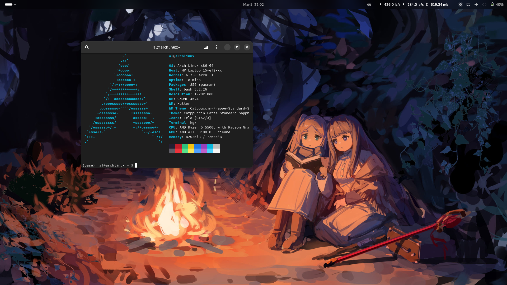

since i ~~jobless~~ have free time, i distro hopping and here's my review:

## fedora

nice, but i am not familiar with dnf

## ubuntu 22.04.3 LTS 

too stable

## popOS

perfect, but this gnome is old and too customize

## manjaro

perfect, but i hate arch-based, not familiar with it

the docs for any app installation just too verbose. 

most of apps only provide docs for .deb or .rpm

## ubuntu 23.10 

i hate snap even though the new GUI store is good. 

but apart from that, everything is smooth

## endeavousOS

i search distro with latest gnome, but i hate snapd and ubuntu. pop os is nice, but cosmic is not intuitive, im more into gnome. 

fedora as i tried for months it is not really that fast, i dont really like dnf or rpm packages, still havent found how to fix dark camera, video player is too slow, but i like the vanilla gnome. 

then i try this, it works like a charm. slow install unlike popos, but boot fast compare to fedora. im not familiar with arch so i give it a try to learn 'yay' and AUR, and i really love it. everything is fast, camera is good, video player works, cs development with vscode and docker is nice. 

its great and the only things that bother me is for gnome, it bloated with preinstalled EOS apps. i think welcome apps could be make simpler, and i hope improvement in UI/UX for quickstart installer. 

keep it up.

## arch

i use arch btw 💀

can't believe [[Pacman]] & yay is perfect

i love gnome <3

