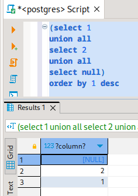
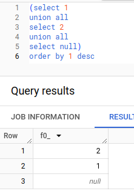

**Background:**
I'm dealing with columns named "location" and "location_id". Some entries have null values in the "location_id" column, while "location" remains populated. This setup poses a few challenges:

## Issue 1: Unjoinable Data

When attempting to join multiple Common Table Expressions (CTEs), I encounter significant data loss when the "location_id" is null. This problem can be mitigated using a cumbersome COALESCE solution as demonstrated below:

```python


    COALESCE({{ cte_source }}.{{ field['col'] }}, {{ field['value_ifnull'] }}) = COALESCE({{ cte_target }}.{{ field['col'] }}, {{ field['value_ifnull'] }})


```

## Issue 2: Disrupting Upsert/Merge Statements in BigQuery

I rely on a daily pipeline using dbt merge. However, the presence of null values in yesterday's data leads to duplicates today, thwarting the merge process. Upon reviewing the compiled dbt, the issue becomes apparent.

HMMMMM...

## Issue 3: Disrupting Ranking, Sorting, etc.

In PostgreSQL:



In BigQuery:



Remember to use `NULLS LAST/FIRST` to properly handle null values when executing ranking queries.

---

I dont realize these articles exist -_- 

[Why should I avoid NULL values in a SQL database?](https://stackoverflow.com/questions/21777697/why-should-i-avoid-null-values-in-a-sql-database). 