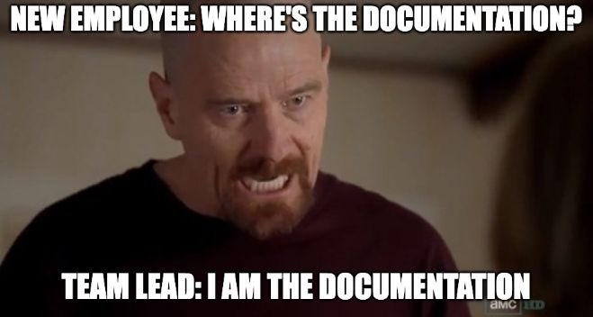

Before, as an IS student, project management is something I've taken for granted.

When I ran projects in university, I learned a lot about IS/PM methodology.

I usually regard project management, or management in general, as just common things and superficial things to learn.

I ask why people spend their money buying these?

When I experienced an internship at the biggest OTA company in Indo, we separate work tools from personal tools. We use tools like JIRA, Confluence, Slack, Google Workspace to improve productivity.

I think it is just common knowledge, no matter what tools they use, the purpose is to improve the communication process, increase transparency, knowledge management, and so on.

---

After that, I graduated and tried a smaller company which is a vendor of a state-owned subsidiary in the telecommunication industry.

I have just realized that each company has its own culture and PM is something that I've overlooked.

In there, we're using everything via WhatsApp. They got ERP teams to develop Odoo, but the product still hasn't been widely adopted in the company.

There is no enforcement in policy or culture to use that.

All users are comfortable with the status quo, checking everything via WhatsApp.

I work with data, but there is no data governance or data documentation.

We just WhatsApp other teams if we don't know something, and then meet via Zoom or Teams to discuss it.

[[Meme]]

IT WASTES MY TIME A LOT!!!

Previously, when I faced a problem, I just opened the Knowledge Management platform and understood seconds by reading it. Now, I need to ask my manager, and then my manager asks other teams, and other teams ask other teams. And other teams said that my team member works on that problem/data.

Like how can people even work like this?

The task management is not really matured, everything is just searched via WhatsApp.

The users which I deal with have no will to use our task management, they only want WhatsApp.

The bureaucratic process, everything is tiring me.

But my teams are okay with it. Only I feel that it is a problem.

Then I realized, there's a culture, there's a human. And if only you feel that it is a problem, it means that you are the problem. Yeah, I guess there's nothing I can do to change if they are comfortable with it.

They are very expert in telecommunication engineering, but since I grew up with an IS/CS degree, I focus on those fields that can be improved. If no one but me senses a problem, then it is not a problem at all.

This makes me learn that I should clarify the company culture before I accept any offers. I need to make sure the company I'm applying to use Git for VCS (Version Control System).

---

Yup, I hate management in general because not everyone has the knowledge of it. 

This might be the curse of knowledge bias.
